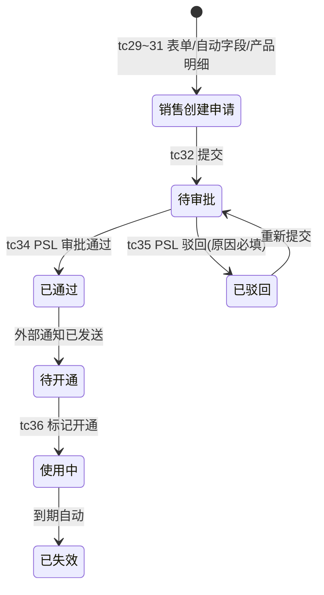

# Feature - 商机 (Opportunity) UAT

> 商机是从"客户有意向"到"签约成交或失单"的完整销售过程记录。验证商机阶段推进、状态切换、搁置/唤醒/成交/失单操作、字段枚举、列表筛选、阶段变更历史、详情页字段与交互。

| 属性 | 内容 |
| :--- | :--- |
| **所属 Theme** | T-01 销售过程管理 |
| **需求文档** | `field-specs/04-商机.md` + `field-specs/06-商机跟进功能审核.md` |
| **原型** | `prototype/src/pages/13-opportunities.html` + `14-opp-detail.html` + modals |
| **状态** | UAT 测试中 |
| **Last Updated** | 2026-08-24 |

## 1. 目的

验证商机模块：列表字段与筛选器、10 级阶段推进、成交/失单终态、阶段变更历史、详情页字段（含自动计算字段）、重要等级权限（S/A 级仅 CEO/售前主管）、过单快车道、AI 字段（痛点/决策链/阶段差距）。

## 2. 范围

| 维度 | 覆盖 |
| :--- | :--- |
| 页面冒烟 | 商机列表页标题、11 列表头、详情页 6 大区块、阶段流转可视化 |
| 页面交互 | 列表筛选、新建商机弹窗、推进阶段弹窗、成交/失单弹窗、阶段变更历史下钻 |
| 控件表单 | 商机名称/关联客户/年化金额/项目属性、重要等级下拉、推进至阶段下拉 |
| 业务流程 | 阶段推进、成交结案、失单结案、终态不可回退、过单快车道 |
| 权限/异常 | 重要等级 S/A 级权限约束、销售仅 B/C 级、终态隐藏编辑入口 |
| 规则回归 | 年化金额自动计算、收入模式自动推导、阶段赢单概率映射、商机名称自动组合 |

### Out of Scope
- BPMS/ERP 合同流转（后端集成）
- Phase 2.5 的立项风险等级计算、阶段赢单概率后台配置
- AI 痛点聚合/决策链全景的生成算法（仅验证展示）

> **⚠️ 提测待核对**：issue 写「搁置/唤醒」操作，需求文档术语为「退回待重启 / 重新激活」（规则 5/7），原型仅有「退回原因」字段、无独立搁置按钮。已按需求术语实现 tc19~21；若线上有独立「搁置」按钮需补用例。

> **⚠️ 提测待核对（原型弹窗未实现）**：以下弹窗在原型中已定义 modal 但详情页无入口或弹窗未实现，已按「按钮/弹窗定义」做观察项用例，提测后需核对线上实际实现：
> - 回退阶段弹窗（`modal-rollback-stage`）：详情页无「回退阶段」按钮，回退操作在跟进记录「阶段操作」里（tc39/40）
> - 指派售前弹窗（`modal-presales-assign`）：详情页只有「换」按钮（售前协同员更换），无独立指派入口（tc41）
> - 成交结案/失单结案弹窗（`modal-close-deal`/`modal-lost-deal`）：详情页按钮引用了不存在的 modal id，点击报 JS 错误（tc9/10/42）

## 3. 测试域

| 域 | 说明 |
| :--- | :--- |
| 商机列表页 | 菜单：商机管道；筛选（商机名称/阶段/项目属性/状态/负责销售/售前协同员/风险标签/重要等级/立项风险） |
| 商机详情页 | 阶段流转可视化 + 阶段变更记录 + 跟进时间线 + 周报追踪 + 技术分析 + 基本信息 + 商务信息 + 关联与交付 |
| 阶段推进 | 10 级阶段：商机获取→初步接触→需求调研→方案设计→POC测试→预算确认→报价确认→条款确认→招投标中→签约中 |
| POC License | 商机管道子 Tab，完整业务流程（tc22/23/29~36） |

### POC License 业务流程（端到端，tc29~36）



## 4. 页面对象 & 选择器

| PO 方法 | 定位策略 | 说明 |
| :--- | :--- | :--- |
| `goto_opportunities` | `/opportunities` | 商机列表页 |
| `verify_list_headers` | `.data-table th` | 11 列表头 |
| `verify_filter_bar` | `.filter-bar select` | 筛选器 |
| `open_create_modal` | `+ 新建商机` 按钮 | 新建弹窗 |
| `verify_create_modal` | `#modal-opp-create` | 新建弹窗字段 |
| `click_row_detail` | `tbody tr` 点击 | 进入详情 |
| `verify_stage_flow` | `#opp-stage-flow` | 阶段流转可视化 |
| `open_advance_modal` | `推进阶段` 按钮 | 推进弹窗 |
| `verify_advance_modal` | `#modal-advance-stage` | 推进弹窗字段 |
| `open_close_deal` | `成交结案` 按钮 | 成交弹窗 |
| `open_lost_deal` | `失单结案` 按钮 | 失单弹窗 |
| `verify_stage_log` | `#opp-stage-log` | 阶段变更记录 |
| `verify_annual_amount` | 商务信息「年化金额」 | 自动计算字段 |

## 5. 测试数据 & 权限

| 账号 | 角色 | 数据范围 |
| :--- | :--- | :--- |
| admin | 管理员 | 全部可读写 |
| cuizhibo | 销售 | 仅本人商机 |
| caizhengli | 销售主管 | 本人+团队 |
| zhangyi | 售前主管 | 全部只读 + 可设 S/A 级 |

> 原型 mock：12 条活跃商机。示例商机「中金数据-冠服联平台」当前阶段=方案设计，年化 35 万（15+40/2）。

## 6. 用例索引

| tc | 标题 | 维度 |
|----|------|------|
| tc01 | 商机列表页标题 | 01_页面元素冒烟 |
| tc02 | 商机列表 11 列表头 | 01_页面元素冒烟 |
| tc03 | 商机列表筛选器 | 03_控件表单 |
| tc04 | 新建商机弹窗 | 02_页面交互 |
| tc05 | 商机详情页区块渲染 | 01_页面元素冒烟 |
| tc06 | 阶段流转可视化 | 01_页面元素冒烟 |
| tc07 | 阶段变更记录 | 01_页面元素冒烟 |
| tc08 | 推进阶段弹窗 | 02_页面交互 |
| tc09 | 成交结案弹窗 | 02_页面交互 |
| tc10 | 失单结案弹窗 | 02_页面交互 |
| tc11 | 年化金额自动计算 | 08_规则回归 |
| tc12 | 收入模式自动推导 | 08_规则回归 |
| tc13 | 重要等级权限（销售仅 B/C） | 05_权限鉴权 |
| tc14 | 重要等级权限（S/A 需 CEO/售前主管） | 05_权限鉴权 |
| tc15 | 过单标记字段 | 08_规则回归 |
| tc16 | 阶段变更历史下钻 | 02_页面交互 |
| tc17 | 详情页技术分析区块 | 01_页面元素冒烟 |
| tc18 | 商机名称自动组合 | 08_规则回归 |
| tc19 | 退回原因字段 | 08_规则回归 |
| tc20 | 阶段操作按钮 | 02_页面交互 |
| tc21 | 终态不可回退 | 08_规则回归 |
| tc22 | POC License 列表 | 01_页面元素冒烟 |
| tc23 | POC License 筛选器 | 03_控件表单 |
| tc24 | 发起询价按钮 | 02_页面交互 |
| tc25 | 编辑技术建议按钮 | 05_权限鉴权 |
| tc26 | 售前协同员更换 | 02_页面交互 |
| tc27 | 收入类型多选 | 08_规则回归 |
| tc28 | 年化金额计算公式 | 08_规则回归 |
| tc29 | POC 创建表单字段完整 | 04_业务流程 |
| tc30 | POC 编号/区域/版本自动填充 | 04_业务流程 |
| tc31 | 产品明细多行增删 | 04_业务流程 |
| tc32 | POC 申请提交 | 04_业务流程 |
| tc33 | 审批流程可视化 | 04_业务流程 |
| tc34 | 售前主管审批通过 | 04_业务流程 |
| tc35 | 审批驳回（原因必填） | 04_业务流程 |
| tc36 | 标记开通（使用中） | 04_业务流程 |
| tc37 | 推进阶段目标选项 | 04_业务流程 |
| tc38 | 阶段推进流程 | 04_业务流程 |
| tc39 | 回退阶段目标选项 | 04_业务流程 |
| tc40 | 回退阶段弹窗已定义 | 04_业务流程 |
| tc41 | 指派售前支持 | 04_业务流程 |
| tc42 | 成交/失单按钮 | 04_业务流程 |
| tc43 | 过单快车道标记 | 04_业务流程 |

## 7. 最小必测集

tc01, tc02, tc05, tc06, tc08, tc11, tc13

## 8. 执行命令

```bash
cd crm-issues/function && pytest opportunity/test_opportunity.py -v --tb=short --env=dev
```

## 9. 关联 Feature

- 跟进记录（商机跟进时间线来源）
- 待办任务（商机阶段推进生成待办）
- 决策看板（商机漏斗/健康度数据源）
